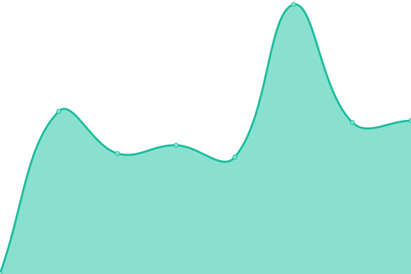
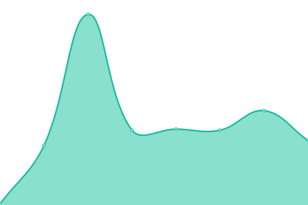

# [📈 Live Status](https://akkijp.github.io/upptime): <!--live status--> **🟧 Partial outage**

This repository contains the open-source uptime monitor and status page for [Kosuke Akizuki](https://rorono.net/), powered by [Upptime](https://github.com/upptime/upptime).

With [Upptime](https://upptime.js.org), you can get your own unlimited and free uptime monitor and status page, powered entirely by a GitHub repository. We use [Issues](https://github.com/akkijp/upptime/issues) as incident reports, [Actions](https://github.com/akkijp/upptime/actions) as uptime monitors, and [Pages](https://akkijp.github.io/upptime) for the status page.

<!--start: status pages-->
<!-- This summary is generated by Upptime (https://github.com/upptime/upptime) -->
<!-- Do not edit this manually, your changes will be overwritten -->
<!-- prettier-ignore -->
| URL | Status | History | Response Time | Uptime |
| --- | ------ | ------- | ------------- | ------ |
|  [Akki JP](https://akki.jp) | 🟩 Up | [akki-jp.yml](https://github.com/akkijp/upptime/commits/HEAD/history/akki-jp.yml) | 

 311ms
     
 | 

<a href="https://upptime.netlify.app/history/akki-jp">100.00%</a>
    

|  [Remote day](https://remote.day) | 🟥 Down | [remote-day.yml](https://github.com/akkijp/upptime/commits/HEAD/history/remote-day.yml) | 

 0ms
     
 | 

<a href="https://upptime.netlify.app/history/remote-day">0.00%</a>
    

|  [Remote day app](https://app.remote.day) | 🟥 Down | [remote-day-app.yml](https://github.com/akkijp/upptime/commits/HEAD/history/remote-day-app.yml) | 

 0ms
     
 | 

<a href="https://upptime.netlify.app/history/remote-day-app">0.00%</a>
    

|  [Google](https://www.google.com) | 🟩 Up | [google.yml](https://github.com/akkijp/upptime/commits/HEAD/history/google.yml) | 

 128ms
     
 | 

<a href="https://upptime.netlify.app/history/google">100.00%</a>
    

<!--end: status pages-->

[**Visit our status website →**](https://akkijp.github.io/upptime)

## 📄 License

- Powered by: [Upptime](https://github.com/upptime/upptime)
- Code: [MIT](./LICENSE) © [Kosuke Akizuki](https://rorono.net/)
- Data in the `./history` directory: [Open Database License](https://opendatacommons.org/licenses/odbl/1-0/)
